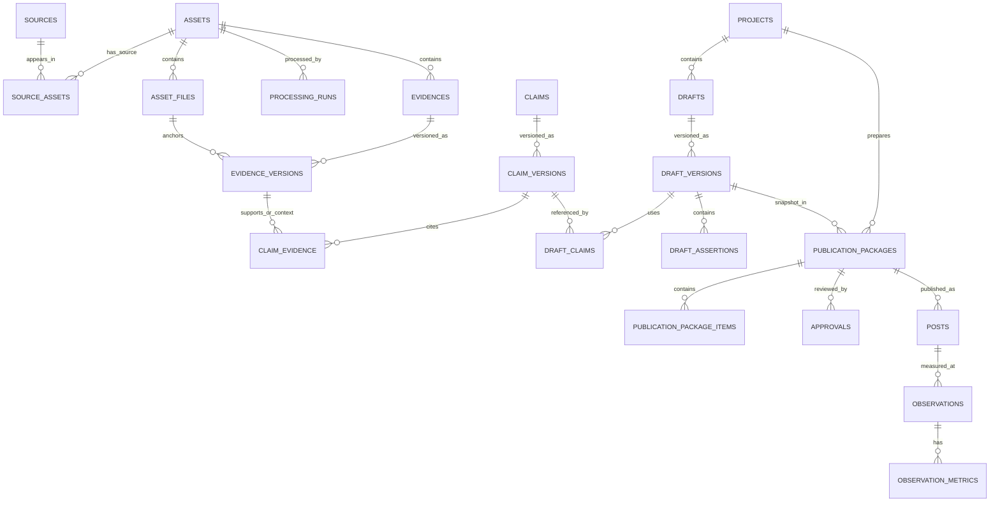

# Creator Loop — Data Architecture V1.1 (baseline triển khai)

**Cập nhật:** 29/09/2026  
**Mục tiêu:** quản lý chắc chuỗi **tư liệu → bằng chứng → nhận định → sáng tạo → duyệt → xuất bản → đo lường** trên một máy; giữ đường mở rộng cho phân tích xu hướng về sau.  
**Trạng thái:** đặc tả logic và Schema Dictionary trước khi viết migration SQLite. Tài liệu này thay thế các bản phác thảo trước trong cuộc trao đổi.

## 1. Phạm vi và nguyên tắc

Creator Loop nhận Video, Image và Text. Tệp tải về **không tự chứa** số lượt xem, ngày đăng, URL gốc, quyền sử dụng hoặc phản ứng khán giả trong mọi trường hợp. Những trường này có thể thiếu và chỉ được bổ sung từ nguồn bài đăng, kết nối được cấp quyền hoặc người dùng. AI có thể bóc tách âm thanh, OCR, khung hình và văn bản; kết quả AI không tự động trở thành sự thật đã xác minh.

V1 quản lý tài sản, chứng cứ, phiên bản, sáng tạo và xuất bản. **Không tạo bảng lõi** cho `learnings`, `content_dna`, `trends`, embedding, search index, JSON export và near-duplicate clusters. Một ảnh riêng lẻ có thể tạo ý tưởng; không đủ để tuyên bố xu hướng. Sau V1, xu hướng cần nhiều nguồn độc lập và chuỗi quan sát theo thời gian.

**Quy tắc nguồn chuẩn:** SQLite lưu ID, quan hệ, phiên bản và lịch sử; tệp video/ảnh/audio nằm ngoài database; JSON có schema chỉ dùng ở những cột thực sự cần cấu trúc biến thiên (ví dụ locator), hoặc làm định dạng trao đổi/xuất file. Không có hai nguồn chuẩn song song.

## 2. Từ điển khái niệm

| Khái niệm | Định nghĩa | Không được lẫn với |
|---|---|---|
| Source | Một địa chỉ/xuất xứ hoặc lần xuất hiện của nội dung: URL, nền tảng, bài đăng, nguồn nhập | Tệp vật lý |
| Asset | Identity logic của tư liệu trong kho | Một đường dẫn trên máy |
| Asset file | Tệp gốc hoặc dẫn xuất cụ thể, có digest và vai trò | Toàn bộ Asset |
| Evidence | Một quan sát có thể định vị trong đúng phiên bản nguồn và kiểm tra lại | Chủ đề, kết luận, đánh giá xu hướng |
| Claim | Nhận định dựa trên một hoặc nhiều Evidence, có thể là factual, interpretive hoặc editorial hypothesis | Câu nói nguyên văn trong nguồn |
| Draft | Identity của một phương án nội dung; mỗi lần sửa tạo Draft Version | Bài đã đăng |
| Publication Package | Snapshot chính xác của nội dung và media đưa đi duyệt | Draft đang tiếp tục chỉnh sửa |
| Post | Bài đăng thực tế trên một nền tảng | Package đã duyệt nhưng chưa đăng |
| Observation | Một lần ghi nhận số liệu của Post tại một thời điểm | Hiệu quả cố hữu của Asset |

### Evidence — định nghĩa ràng buộc

Evidence là **một đơn vị nội dung có thể định vị trong một phiên bản nguồn cụ thể và kiểm tra lại bằng chính nguồn đó**. Nó chứa `anchor_file_id`, `locator_type`, `locator_data`, `content`, phương pháp tạo, run/actor tạo và version. Một quan sát do AI tạo vẫn là Evidence *chưa kiểm tra*; việc gọi nó là Evidence không có nghĩa nó đúng. Claim mới diễn giải ý nghĩa của quan sát.

Độ hạt: đủ nhỏ để kiểm tra độc lập, nhưng không buộc mỗi từ thành một dòng. Một câu chép lời, một vùng ảnh, hoặc một đoạn văn là hợp lý; cả video với nhãn “sống chậm” là quá rộng. Một Claim có thể nối với Evidence hỗ trợ, phản chứng hoặc bối cảnh.

### Ba ví dụ dựa trên đầu vào trong cuộc trao đổi

1. **Video:** Mockup người dùng đưa có `HueKha.mp4` và transcript hiển thị “Nhưng nhiều người vẫn…” ở khoảng `00:37–00:52`. Đây **chỉ là thông tin trên mockup**, chưa xem video gốc. Evidence trong kho thật chỉ được tạo khi có tệp và đối chiếu đoạn âm thanh; `locator=TIME_RANGE`, `track=audio`, trạng thái ban đầu `chưa kiểm tra`.
2. **Image:** Ảnh mockup được tải lên thực sự hiển thị tiêu đề “5 lớp dữ liệu trong mỗi Asset” cùng năm nhãn ORIGINAL, MACHINE EVIDENCE, CREATOR EVIDENCE, DERIVED KNOWLEDGE, USAGE HISTORY. Evidence `VISUAL_OBSERVATION` có locator vùng giữa bên trái của ảnh mockup. Nó chứng minh *mockup ghi các nhãn đó*, không chứng minh các asset minh họa bên trong tồn tại.
3. **Text:** Tin nhắn người dùng ghi “Tôi thấy còn một lớp cần thiết kế trước khi viết database: định nghĩa chính xác Evidence là gì.” Evidence `DIRECT_TEXT` trỏ tới câu và text snapshot của tin nhắn. Claim “người dùng đã phê duyệt database” không thể suy ra từ câu này.

## 3. ERD V1.1 đã chốt

Các đường dưới đây nêu quan hệ nghiệp vụ. N:M được triển khai bằng bảng nối; quan hệ tới nội dung luôn dùng ID **phiên bản cụ thể**.



`PROJECT_REFERENCES`, `SELECTION_EVENTS`, `REVIEW_EVENTS` và Tags là quan hệ/nghiệp vụ hỗ trợ, được định nghĩa ở phần bảng. `REVIEW_EVENTS` không dùng FK đa hình giả; dùng các FK nullable với CHECK đúng một target. ERD là sơ đồ logic; các điều kiện liên bảng không biểu diễn được trong Mermaid nằm ở quy tắc nghiệp vụ.

## 4. Vòng đời, duyệt và sửa

- **Xử lý tách theo task:** transcription thành công, OCR chưa chạy và visual analysis lỗi có thể đồng thời đúng. `processing_runs` là nguồn chuẩn; trạng thái Asset trên UI là tổng hợp có nhãn từng task.
- **Kiểm tra tách khỏi xử lý:** AI đã bóc tách ≠ con người đã chấp nhận. `review_events` là lịch sử append-only của ACCEPT/CORRECT/REJECT/REQUEST_CHANGES/REOPEN. Trạng thái hiện hành được tính từ lịch sử hoặc materialized projection có thể tái tạo.
- **Chặn REPLACE snapshot:** migration0005 dùng BEFORE INSERT guards cho identity/version/seal, review, Package/items, Approval/Post và Observation/metrics, kể cả unique key thứ cấp; không dựa vào DELETE trigger vì SQLite REPLACE có thể bỏ qua nó khi recursive_triggers tắt. Claim type gắn với identity và không đổi để tái diễn giải các version cũ; phân loại khác tạo Claim mới. Không ngăn soft-delete, relocation storage_key hoặc cập nhật trạng thái Post theo contract.
- **Sửa không ghi đè lịch sử:** sửa Evidence/Claim/Draft tạo version mới. Những Claim phụ thuộc Evidence version cũ được đánh dấu cần xem lại ở projection/queue. Package cũ vẫn trỏ version đã duyệt.
- **Khóa trích dẫn Claim Version:** ứng dụng thêm toàn bộ `claim_evidence` rồi tạo `claim_version_seals` trong cùng transaction. Sau seal không thêm, sửa hoặc xóa quan hệ trích dẫn; sửa nhận định hay tập trích dẫn tạo Claim Version mới. Migration 0002 seal các Claim Version lịch sử của schema 1, kể cả bản trước đó chưa có trích dẫn; bản tạo sau migration phải có ít nhất một trích dẫn mới được seal.
- **Khóa snapshot Draft Version:** ứng dụng ghi body, toàn bộ parents/Claim citations/assertions rồi tạo `draft_version_seals` trong cùng transaction. Sau seal không thêm/sửa/xóa các quan hệ này; sửa nội dung hoặc nguồn tạo Version mới. Parent thuộc cùng Project và là snapshot sealed, child mới không tạo chu trình; seal kiểm lại graph. Assertion khớp substring/offset trên đúng `body_text`, Claim nếu có phải thuộc `draft_claims` của Version đó; `SUPPORTED` cần Claim Version cụ thể, không thay ngưỡng publication. Migration 0003 kiểm graph/assertions/citations lịch sử trước seal; dữ liệu không hợp lệ làm migration rollback, giữ backup để xử lý. Package chỉ nhận Draft snapshot sealed.
- **Duyệt đúng snapshot:** Đường ghi ứng dụng tạo Package ở trạng thái nội bộ `building`, thêm toàn bộ items, kiểm đủ `item_count`, rồi `sealed_at` và commit **trong một transaction**. Chỉ Package đã sealed mới là snapshot được duyệt; sau seal Package và items bất biến. Direct SQL có thể commit dòng building không hoàn chỉnh, nhưng không thể seal/duyệt nó nếu thiếu item. Đây là dữ liệu staging lỗi cần được dọn có kiểm soát, không hiển thị như Package hợp lệ. Fingerprint bao gồm manifest chuẩn hóa, thứ tự item, text và digest media. Sửa caption/media tạo Package mới. Approval cũ vẫn lưu nhưng không áp dụng cho Package mới.
- **Đăng:** chỉ tạo lệnh đăng khi có approval APPROVED hợp lệ cho đúng Package/fingerprint và chưa REVOKED. Bài đăng và lần đo là đối tượng riêng. Retry không được biến một bài đã đăng thành bài khác.
- **Quyền sử dụng:** `REFERENCE_ONLY` cho phép học/gợi ý góc kể, không mặc nhiên cho phép đăng lại tệp. Kiểm tra trước khi đóng Package.

## 5. Locator contract V1

Chốt `locator_type` cộng `locator_data` JSON **có schema**, lưu trong SQLite; ứng dụng validate schema. `anchor_file_id` cố định tệp và digest tương ứng. Đơn vị thời gian là milliseconds; tọa độ ảnh tỷ lệ `[0,1]` sau khi chuẩn hóa orientation; vị trí text là Unicode code point trên text snapshot chuẩn hóa NFC.

```json
{"locator_type":"TIME_RANGE","locator_data":{"start_ms":10000,"end_ms":23000,"track":"audio"}}
{"locator_type":"IMAGE_REGION","locator_data":{"x":0.12,"y":0.20,"width":0.35,"height":0.25}}
{"locator_type":"TEXT_RANGE","locator_data":{"start":120,"end":185,"text_digest":"sha256:..."}}
{"locator_type":"WHOLE_ASSET","locator_data":{}}
```

TIME_RANGE: `0 <= start < end <= duration` nếu biết duration. IMAGE_REGION: `x,y >= 0`, `width,height > 0`, `x+width,y+height <= 1`. TEXT_RANGE: `0 <= start < end <= length(snapshot)`. WHOLE_ASSET chỉ dùng khi toàn nguồn thực sự liên quan. `CHECK(json_valid(locator_data))` bảo vệ cú pháp; schema validator của ứng dụng kiểm tra loại và giới hạn. Không dùng JSON tự do ngoài contract.

## 6. Schema Dictionary V1.1

**Ký hiệu:** PK = khóa chính; FK = khóa ngoại; NN = NOT NULL; `?` = nullable. Mặc định ID là TEXT UUID/ULID. Timestamp ISO 8601 UTC. NULL biểu thị chưa biết/không áp dụng; không thay bằng 0 hoặc chuỗi rỗng. Các version, event, observation và Package là append-only. Bật `PRAGMA foreign_keys=ON`, WAL và `busy_timeout` trên mọi connection. Tệp lớn ở ngoài SQLite.

### A. Library

| Bảng | Các trường lõi | Ràng buộc và lý do NULL |
|---|---|---|
| `sources` | `source_id` PK; `platform` NN; `canonical_url`?; `external_id`?; `publisher_name`?; `published_at`?; `captured_at`?; `rights_status` NN; `created_at` NN | URL/ID/ngày đăng có thể vắng khi nhập tệp. UNIQUE `(platform, external_id)` khi ID có giá trị. Ngày đăng khác ngày nhập. |
| `assets` | `asset_id` PK; `media_type` NN; `display_name` NN; `created_at` NN; `deleted_at`? | Identity logic; không có `processing_state` nguồn chuẩn. Xóa mềm khi cần. |
| `source_assets` | `source_id` FK NN; `asset_id` FK NN; `relationship_type` NN; `verification_status` NN; `recorded_at` NN | PK `(source_id,asset_id,relationship_type)`; `ORIGIN/REPOST/REFERENCE/UNKNOWN`. Không mặc định tên tệp chứng minh xuất xứ. |
| `asset_files` | `file_id` PK; `asset_id` FK NN; `role` NN; `storage_key` NN; `sha256` NN; `byte_size` NN; `mime_type` NN; `parent_file_id` FK?; `processing_run_id` FK?; `created_at` NN; `width_px`?; `height_px`?; `duration_ms`? | Original không có parent/run; dimension tùy media. `byte_size >= 0`. File dẫn xuất trỏ parent. FK/trigger đảm bảo parent thuộc Asset phù hợp. Không UNIQUE hash toàn cục vì hai Asset có ngữ cảnh khác nhau. |
| `processing_runs` | `run_id` PK; `asset_id` FK NN; `input_file_id` FK?; `task_type` NN; `status` NN; `tool_name` NN; `tool_version` NN; `model_name`?; `model_version`?; `started_at`?; `finished_at`?; `error_code`?; `error_message`?; `created_at` NN | `QUEUED/RUNNING/SUCCEEDED/FAILED/CANCELLED`. Run kết thúc phải có `finished_at`; lỗi chỉ có khi cần. UI tổng hợp theo task, không một completed toàn Asset. |

### B. Knowledge

| Bảng | Các trường lõi | Ràng buộc và lý do NULL |
|---|---|---|
| `evidences` | `evidence_id` PK; `asset_id` FK NN; `evidence_type` NN; `created_at` NN; `deleted_at`? | Identity logic. Type: `SPEECH/OCR_TEXT/VISUAL_OBSERVATION/DIRECT_TEXT/METADATA/OTHER`. |
| `evidence_versions` | `evidence_version_id` PK; `evidence_id` FK NN; `version_no` NN; `anchor_file_id` FK NN; `content` NN; `locator_type` NN; `locator_data` NN; `producer_type` NN; `processing_run_id` FK?; `created_by`?; `created_at` NN | UNIQUE `(evidence_id,version_no)`, version > 0; `json_valid`; anchor phải thuộc cùng Asset. Human edit không có run; machine output không cần human actor. Không ghi đè version. |
| `claims` | `claim_id` PK; `claim_type` NN; `created_at` NN; `deleted_at`? | `FACTUAL/INTERPRETIVE/EDITORIAL_HYPOTHESIS`. Identity logic. |
| `claim_versions` | `claim_version_id` PK; `claim_id` FK NN; `version_no` NN; `statement` NN; `created_by`?; `created_at` NN | UNIQUE `(claim_id,version_no)`; version > 0. |
| `claim_evidence` | `claim_version_id` FK NN; `evidence_version_id` FK NN; `relation_type` NN | PK cả ba; `SUPPORTS/CONTRADICTS/CONTEXT`. Không biến phản chứng thành hỗ trợ. |
| `claim_version_seals` | `claim_version_id` PK/FK NN; `sealed_at` NN | Chỉ seal sau khi có trích dẫn (ngoại lệ dữ liệu schema 1 đã migration). Seal và tập `claim_evidence` bất biến; đường ghi ứng dụng hoàn tất cả hai trong một transaction. |
| `review_events` | `review_event_id` PK; `evidence_version_id` FK?; `claim_version_id` FK?; `draft_version_id` FK?; `action` NN; `actor_id` NN; `reason`?; `created_at` NN | CHECK đúng **một** target FK khác NULL. Append-only. `CORRECT` tạo version mới; sự kiện có thể tham chiếu bản thay thế bằng các FK replacement theo loại nếu UI cần điều hướng trực tiếp. Không dùng `target_type,target_id` mà thiếu FK. |

### C. Creator Workspace

| Bảng | Các trường lõi | Ràng buộc và lý do NULL |
|---|---|---|
| `projects` | `project_id` PK; `title` NN; `status` NN; `created_at` NN; `deleted_at`? | `ACTIVE/ARCHIVED`. |
| `project_references` | `project_reference_id` PK; `project_id` FK NN; `asset_id` FK?; `claim_version_id` FK?; `source_id` FK?; `usage_intent` NN | CHECK **đúng một** trong ba target FK có giá trị; `RESEARCH/QUOTE/REUSE_MEDIA`. Muốn tham chiếu nhiều đối tượng thì tạo nhiều dòng riêng. Điều kiện SQLite: `(asset_id IS NOT NULL) + (claim_version_id IS NOT NULL) + (source_id IS NOT NULL) = 1`. |
| `drafts` | `draft_id` PK; `project_id` FK NN; `status` NN; `created_at` NN | Một Project có nhiều phương án. |
| `draft_versions` | `draft_version_id` PK; `draft_id` FK NN; `version_no` NN; `body_text` NN; `format` NN; `created_by`?; `created_at` NN | UNIQUE `(draft_id,version_no)`; version > 0. Snapshot mỗi lần thay đổi thực sự. |
| `draft_version_seals` | `draft_version_id` PK/FK NN; `sealed_at` NN | Snapshot parents/citations/assertions hoàn tất trước khi expose; seal và các quan hệ bất biến sau seal. |
| `draft_version_parents` | `child_draft_version_id` FK NN; `parent_draft_version_id` FK NN; `relation_type` NN | PK hai ID; không self-link. Hỗ trợ kết hợp A+B, không ép một parent duy nhất. Kiểm tra không chu trình ở ứng dụng. |
| `draft_claims` | `draft_version_id` FK NN; `claim_version_id` FK NN; `use_type` NN | PK hai ID; `ASSERTED/INSPIRATION/QUOTE/BACKGROUND`. Liên kết không có nghĩa Claim đã xuất hiện nguyên văn. |
| `draft_assertions` | `assertion_id` PK; `draft_version_id` FK NN; `text_start` NN; `text_end` NN; `asserted_text` NN; `claim_version_id` FK?; `review_state` NN | Offset trên `body_text` version này; `0 <= start < end`; NULL Claim cho câu sáng tạo/cần nguồn, trạng thái phải nói rõ `UNREVIEWED/SUPPORTED/NEEDS_SOURCE/EDITORIAL`. |
| `selection_events` | `selection_event_id` PK; `project_id` FK NN; `selected_draft_version_id` FK NN; `candidate_set_id` NN; `reason_text`?; `actor_id` NN; `created_at` NN | Ghi Creator chọn gì và vì sao; không tạo taste score. |
| `selection_candidates` | `selection_event_id` FK NN; `draft_version_id` FK NN | PK hai ID; selected version phải thuộc tập ứng viên, ràng buộc kiểm tại transaction/ứng dụng. |
| `selection_event_seals` | `selection_event_id` PK/FK; `sealed_at` NN | Niêm phong event cùng toàn bộ tập ứng viên; seal kiểm selected membership, sealed Draft Versions và cùng Project; sau seal không thêm/sửa/xóa tập hoặc event. |

Selection service tạo event, tập ứng viên và seal trong một transaction; chỉ event đã seal được đọc như quyết định hoàn tất. Mỗi quyết định mới có `candidate_set_id` riêng cho tập exact Versions đó; quyết định mới không ghi đè quyết định trước. Migration giữ lịch sử hợp lệ, từ chối lịch sử sai membership/Project; `reason_text` vắng vẫn là NULL. Selection không cấp Approval xuất bản hoặc taste score.
Các guard INSERT cũng chặn SQLite REPLACE tái dùng Selection event/seal, Draft identity hoặc Draft Version ID/number; không để đường thay hàng làm đổi Project/body mà quyết định lịch sử tham chiếu.

### D. Publication

| Bảng | Các trường lõi | Ràng buộc và lý do NULL |
|---|---|---|
| `publication_packages` | `package_id` PK; `project_id` FK NN; `draft_version_id` FK NN; `platform` NN; `format` NN; `fingerprint` NN; `item_count` NN; `sealed_at`?; `created_at` NN | `sealed_at` NULL khi building nội bộ. Public repository tạo và seal trong một transaction. Approval chỉ áp dụng khi sealed và item count khớp; sau seal bất biến. Fingerprint không UNIQUE toàn cục. Package/draft phải thuộc cùng Project. |
| `publication_package_items` | `package_item_id` PK; `package_id` FK NN; `item_type` NN; `position` NN; `text_payload`?; `file_id` FK?; `content_digest` NN | UNIQUE `(package_id,item_type,position)`; tùy type, đúng một text/file. Media digest là bytes sẽ đăng; item được thêm trước khi seal, không sửa/thêm sau seal. |
| `approvals` | `approval_id` PK; `package_id` FK NN; `package_fingerprint` NN; `decision` NN; `actor_id` NN; `decided_at` NN; `reason`? | `APPROVED/REJECTED/REVOKED`. Quyết định hợp lệ cuối cùng phải áp đúng fingerprint; append-only. |
| `posts` | `post_id` PK; `package_id` FK NN; `platform` NN; `external_post_id`?; `external_url`?; `published_at`?; `status` NN; `created_at` NN | ID/link/ngày đăng vắng khi pending/failed. UNIQUE `(platform,external_post_id)` khi external ID có giá trị. Các lần thử thất bại nên có `publication_attempts` khi làm auto-publish; V1 đăng thủ công có thể ghi event tối thiểu. |
| `observations` | `observation_id` PK; `post_id` FK NN; `observed_at` NN; `collector_type` NN; `processing_run_id` FK?; `created_at` NN | `API/MANUAL/IMPORT`. Run NULL khi nhập tay. Nhiều lần đo mỗi Post; thời gian đo khác thời gian đăng. |
| `observation_metrics` | `observation_id` FK NN; `metric_key` NN; `metric_scope` NN; `numeric_value` NN; `unit` NN; `definition_version` NN; `raw_value`? | PK `(observation_id,metric_key,metric_scope)`; số count >= 0. Không gộp views/reach/impressions; định nghĩa có thể khác nền tảng. |

### Tags V1

`tags(tag_id PK, name NN, normalized_name NN UNIQUE, created_at NN)`. Chỉ tạo bảng nối cho nơi cần dùng thực tế (`asset_tags`, `claim_version_tags`, v.v.); mỗi bảng nối có hai FK và composite PK. Có thể dùng view hợp nhất cho UI. Không dùng `tag_links(target_type,target_id)` rồi tuyên bố có foreign key đầy đủ. Nếu nhãn thay theo phiên bản, gắn vào version ID.

## 7. Ràng buộc liên bảng và dữ liệu thiếu

Một số bất biến cần transaction/trigger/ứng dụng vì CHECK đơn bảng không đủ:

1. Evidence anchor file cùng Asset với Evidence identity; time range hợp lệ theo duration của tệp.
2. Package trỏ Draft Version thuộc Project; Post platform khớp Package platform; item media đúng tệp và digest.
3. `project_references` có đúng một target FK mỗi dòng; Selected Draft Version nằm trong tập `selection_candidates` và thuộc Project.
4. Chỉ Package sealed, đủ item, đúng Project/Draft mới được duyệt; tạo lệnh đăng chỉ khi Approval còn hiệu lực. Public application path không cấp raw writable connection, PublicationRepository là đường tạo Package. SQLite file không phải security sandbox trước người sửa DB trực tiếp.
5. **Ngưỡng factual V1, quyết định người dùng 03/10/2026:** mỗi Claim Version `FACTUAL` được Draft Version của Package tham chiếu phải có trạng thái review hiện hành `ACCEPT` của người duyệt, và ít nhất **1** Evidence Version liên kết `SUPPORTS` có trạng thái review hiện hành `ACCEPT` của người duyệt. Kiểm đúng các version đã ghim trong Package; không thay bằng version mới nhất hoặc dùng ACCEPT trong lịch sử đã bị REOPEN/REJECT/REQUEST_CHANGES/CORRECT thay thế. Evidence được tính phải còn hiệu lực và mở lại đúng anchor/digest. CONTEXT/CONTRADICTS không tính vào ngưỡng. Thiếu điều kiện phải chặn xuất bản factual và hiển thị lý do cùng version liên quan. Kiểm lại tại transaction duyệt/đăng, kết quả kiểm trước đó không cấp quyền đăng. Ngưỡng này không cấp Approval hay quyền media; giả thuyết editorial vẫn phải được thể hiện là giả thuyết, không như sự thật.
6. Khi sửa Evidence, lịch sử Claim cũ giữ nguyên; projection việc cần xem lại được cập nhật hoặc tạo lại từ graph dependency.
7. `NULL` không phải bằng 0: thiếu số liệu do chưa kết nối, thiếu URL do chỉ có tệp, thiếu ngày do metadata không có, hoặc không áp dụng là các trường hợp khác nhau. Lưu reason khi ảnh hưởng quyết định.
8. `sources.rights_status` không thay thế thẩm định quyền đối với từng tệp nếu nhiều nguồn mâu thuẫn; mặc định thận trọng cho `UNKNOWN`.

## 8. Thứ tự triển khai và tiêu chí chấp nhận

**Bước 1 — Library:** nhập video, ảnh, text; giữ original; chuyển storage location không đổi Asset ID; nhiều Source nối cùng Asset.  
**Bước 2 — Knowledge:** tạo Evidence với locator mở lại đúng vị trí; chỉnh tạo version mới; Claim nối Evidence version, có hỗ trợ/phản chứng; lịch sử review không mất.  
**Bước 3 — Creator:** tạo nhiều Draft Version, chọn A/B/C và kết hợp A+B; assertion trong bài trỏ về Claim/version hoặc hiển thị cần nguồn.  
**Bước 4 — Publication:** đóng Package, duyệt, thay caption tạo Package mới cần duyệt lại; Post gắn Package; nhiều Observation và metric có thời gian/định nghĩa.

**Kiểm thử chặn phát hành V1:**

- Không thể tạo FK mồ côi, kể cả sau khi xóa mềm.
- Evidence mở đúng đoạn video, vùng ảnh hoặc đoạn text của bản nguồn đã nhập.
- Dữ liệu bản cũ không đổi sau correction; các phụ thuộc cần xem lại được phát hiện.
- Approval cũ không cho phép đăng Package mới hoặc media khác digest.
- Từng metric có Post, thời điểm, platform, định nghĩa và phương pháp thu thập.
- Backup/restore SQLite cùng kho tệp trả lại quan hệ đầy đủ; không lấy index/JSON export làm nguồn phục hồi chính.

## 9. Ranh giới cho giai đoạn sau

Search index là projection tái tạo từ SQLite. JSON export là snapshot trao đổi, có version/schema. Trend cần ingest theo thời gian, deduplicate và baseline; Learning/Content DNA chỉ xây từ dữ liệu đã có provenance và kết quả đo đáng tin. Khi nhiều người ghi đồng thời trên nhiều máy chủ, có thể chuyển từ SQLite sang database server mà giữ mô hình logic/versioning. Máy 8 GB có thể chạy database metadata; xử lý media/model mới là phần cần chạy tuần tự và kiểm soát RAM.

## 10. Liên kết với contract triển khai

Tài liệu này là **nguồn chuẩn duy nhất cho luật dữ liệu**. `Creator_Loop_CICD_Release_Contract_V1.md` quy định pipeline và cập nhật; `Creator_Loop_Layout_Contract_V1.md` quy định tách installation/user data; `Codex_Master_Prompt_V2.md` là handoff, không được tự sửa các luật ở đây. Nếu phát hiện xung đột, dừng implementation, sửa baseline trước rồi mới sửa migration/test cùng một PR.

Các gate bắt buộc trong CI: `project_references` đúng một target; `review_events` đúng một target; Evidence anchor file cùng Asset; Claim trỏ đúng Evidence Version; Package/Draft cùng Project; Post/platform khớp Package; Package bất biến và approval chỉ hợp lệ cho fingerprint tương ứng. Migration phải kiểm `integrity_check`, `foreign_key_check` và `schema_version`; không được coi riêng `integrity_check` là đủ.
